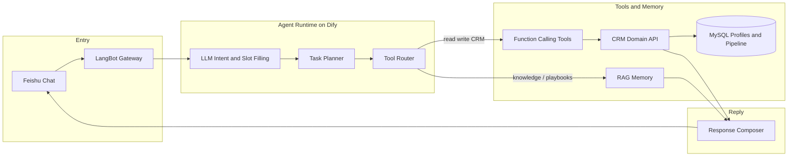

# DifyCRM

**Feishu-native AI CRM Agent** — talk to your pipeline in natural language; structured business data stays in MySQL, knowledge stays in RAG, every write goes through **function calling**.

[](LICENSE)
[](https://www.python.org/)
[](#architecture)

Product case page: [www.yangjiapei.com/cases/difycrm](https://www.yangjiapei.com/cases/difycrm/)

---

## Why DifyCRM

Sales teams already live in chat. They should not open another heavy CRM just to ask:

- “What’s going on with this lead?”
- “Who should I follow up this week?”
- “How is the funnel looking?”

DifyCRM turns Feishu messages into a **tool-using Agent**: intent → plan → route → call domain tools → compose a reply. It is not a free-form chatbot that invents pipeline numbers.

---

## Agent capabilities

| Capability | What it does |
|------------|----------------|
| **NLU / Intent** | Parse natural language (or `/slash` commands) into CRM intents and slots |
| **Planner** | Single-step or multi-step tool plans for read / write / analysis |
| **Router** | Split traffic: RAG for soft knowledge, MySQL for profiles & money states |
| **Function calling** | Bound tools such as `create_lead`, `score_lead`, `convert_lead`, `dashboard`… |
| **Domain API** | Validation, ownership, and durable writes in one place |
| **RAG / Memory** | Playbooks, FAQ, cases, policies as non-structured context |
| **Response composer** | Merge structured results + retrieved snippets into Feishu-ready replies |

Covered CRM surface today: channels, campaigns, leads (create / list / score / convert), customers, follow-ups, source & acquisition analytics, funnel, personal dashboard.

---

## Architecture



**Data rule of thumb**

- Profiles, amounts, stages, owners → **MySQL** via Domain API  
- Playbooks, FAQ, narratives → **RAG**  
- Mutating actions → **function calling only** (no silent LLM side effects)

---

## Repository layout

```text
DifyCRM/
├── src/          # FastAPI domain service + command router
├── sql/          # schema + demo seed
├── scripts/      # init DB / start API / smoke test
├── dify/         # workflow DSL (crm-main.yml) + OpenAPI notes
├── docs/         # product map, DEMO script, PRD
├── .env.example
└── requirements.txt
```

---

## Quick start (API only)

**Requires:** Python 3.10+, local MySQL.

```powershell
copy .env.example .env
python -m venv .venv
.\.venv\Scripts\activate
pip install -r requirements.txt
.\scripts\init_db.ps1
.\scripts\start_api.ps1
```

Health check:

```powershell
Invoke-RestMethod http://127.0.0.1:5055/health
```

Unified Agent / tool entry:

```http
POST http://127.0.0.1:5055/assistant/command
Content-Type: application/json

{
  "message": "列出当前线索",
  "sender_id": "demo_sales"
}
```

From Dify inside Docker to the host API, use `http://host.docker.internal:5055`.

---

## Full Feishu experience

This repo ships the **domain brain** (API + SQL + DSL). Runtime pieces live outside:

1. Import [`dify/crm-main.yml`](dify/crm-main.yml) into your Dify instance (`crm_main`, end field `summary`).
2. Configure the LLM node (e.g. DeepSeek / other provider in your Dify console).
3. Point the HTTP / tool node at `/assistant/command`.
4. Wire LangBot → that Dify app → Feishu bot.

Details: [dify/README-DIFY-INTEGRATION.md](dify/README-DIFY-INTEGRATION.md) · [docs/DEMO.md](docs/DEMO.md) · [docs/CRM-入门与指令地图.md](docs/CRM-入门与指令地图.md)

---

## Example function calling tools

| Tool | Purpose |
|------|---------|
| `create_channel` / `create_campaign` | Acquisition setup |
| `create_lead` / `list_leads` / `score_lead` / `convert_lead` | Lead lifecycle |
| `create_customer` / `list_customers` | Accounts |
| `add_followup` | Activity + summary |
| `source_stats` / `acquisition_stats` / `funnel_stats` / `dashboard` | Analytics |
| `help` | Capability menu |

---

## Configuration

Copy `.env.example` → `.env`. Do **not** commit real `.env` or cloud API keys.

| Variable | Role |
|----------|------|
| `APP_HOST` / `APP_PORT` | API bind |
| `MYSQL_*` | Database |
| `PUBLIC_API_BASE` | Hint for container → host access |

---

## License

[MIT](LICENSE)
