# DifyCRM 与 Dify/LangBot 集成

## 1. 关键原则

Dify 不承载 CRM 业务状态，只负责：

- LLM 意图识别
- RAG 知识库检索
- 调用 `DifyCRM API`
- 整理回复给 LangBot/飞书

所有关键业务写入 `MySQL dify_crm`。

## 2. API 地址

Windows 宿主机访问：

```text
http://127.0.0.1:5055
```

Dify Docker 容器内访问：

```text
http://host.docker.internal:5055
```

## 3. 推荐 Dify 工作流结构

不是用一个工作流实现全部业务，而是用工作流作为 AI 编排层：

```mermaid
flowchart LR
  startNode["开始"] --> mergeNode["合并原始输入"]
  mergeNode --> llmNode["LLM: 自然语言转指令"]
  llmNode --> cleanNode["提取 CRM 指令"]
  cleanNode --> inputNode["输入标准化"]
  inputNode --> classifyNode["指令预分类"]
  classifyNode --> payloadNode["组装 API 请求"]
  payloadNode --> apiNode["HTTP: POST /assistant/command"]
  apiNode --> parseNode["解析 CRM 响应"]
  parseNode --> formatNode["飞书回复整理"]
  formatNode --> finalNode["结束: summary"]
```



用户可直接说自然语言，例如「帮我看看各渠道获客效果」；LLM 会解析为 `/获客分析` 再调 CRM API。仍兼容直接发 `/指令`。

### 开始节点变量

| 变量 | 类型 | 说明 |
|------|------|------|
| `user_message_text` | text | 飞书/LangBot 用户消息 |
| `sender_id` | text | 飞书用户 ID，没有则填 `demo_sales` |

### HTTP 节点

URL：

```text
http://host.docker.internal:5055/assistant/command
```

Method：`POST`

Body：

```json
{
  "message": "{{#start.user_message_text#}}",
  "sender_id": "{{#start.sender_id#}}"
}
```

取返回：

- `reply` 作为飞书回复
- `data` 给后续 LLM/RAG 节点使用

## 4. LangBot 配置

LangBot 流水线仍然使用 Dify 服务 API：

- Base URL：`http://dify-nginx/v1`
- 应用类型：Workflow
- 回复字段：结束节点 `summary`

## 5. RAG 知识库建议

把 `sql/seed.sql` 中 `knowledge_assets` 的内容扩展为文档，导入 Dify 知识库：

- 获客营销话术库
- AI CRM 演示 FAQ
- 线索评分规则
- 产品介绍
- 成功案例
- 竞品对比

注意：不要把客户电话、商机金额、线索状态等结构化数据导入知识库。
