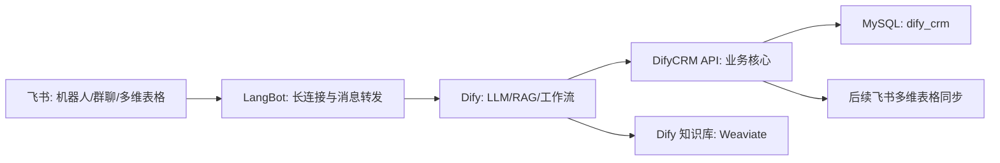

# 飞书智能 CRM 系统 PRD

版本：3.0  
日期：2026-06-04  
项目目录：`G:\AIstudy\DifyCRM`  
产品定位：以获客营销为核心的飞书智能 CRM 业务系统

## 1. 重构说明

原 PRD 将客户、销售、服务、分析、AI 子流程全部放到一个 Dify 主工作流中，同时使用 SQLite。该设计适合演示脚本，但不适合后续扩展，也不符合当前已确认的环境边界。

本版做如下大改：

- 关键业务数据统一落 MySQL：库名 `dify_crm`。
- CRM API 是业务核心，Dify 不是数据库，也不是全部业务逻辑的承载处。
- 飞书优先承担协作、展示、移动端入口和后续多维表格看板。
- Dify 负责 LLM、RAG、自然语言转指令和复杂建议。
- 第一阶段重点做获客营销，不把客服、合同、审批、审计做成主线。

## 2. 产品目标

系统目标是证明一套可落地的“飞书 + Dify + MySQL + AI”获客营销 CRM 闭环：

1. 市场人员创建渠道与营销活动。
2. 线索进入系统并自动评分。
3. 销售查看高分线索、记录跟进。
4. 高意向线索转为客户和商机。
5. 管理者查看来源、渠道、漏斗和转化瓶颈。
6. Dify 基于 RAG 和结构化数据生成跟进建议、话术和分析。

## 3. 系统边界

### 3.1 本地 MySQL

保存关键且需要精确查询的数据：

- 渠道、活动、线索
- 线索评分和评分原因
- 客户、联系人、标签
- 商机、跟进、任务
- 基础工单数据
- 统计分析所需结构化字段

### 3.2 飞书

优先承载体验层：

- 机器人对话
- 群内协作
- 后续多维表格看板
- 临时清单、活动名单、人工修正入口
- 审批、待办、日历等原生能力

### 3.3 Dify

负责 AI 与编排：

- 自然语言转业务指令
- 调用 CRM API
- RAG 问答
- 跟进总结、标签推荐、阶段建议、渠道分析解读
- 把结果返回给 LangBot/飞书

### 3.4 RAG 边界

进入 RAG：

- 产品资料
- 获客话术
- 销售 FAQ
- 竞品材料
- 成功案例
- 活动 SOP
- 合同/服务政策模板

不进入 RAG：

- 线索状态
- 客户电话
- 商机金额
- 任务状态
- 跟进日期
- 渠道成本

混合使用场景：

“分析张明这个线索下一步怎么推进”应先查 MySQL 中线索来源、评分、预算、跟进记录，再从 RAG 取话术、案例和产品资料，最后生成建议。

## 4. 一体化架构



系统不是多个松散工具拼起来，而是以 `DifyCRM API` 为业务中心：

- 所有入口都调用同一套 API。
- 所有关键状态都写入同一个 MySQL 库。
- Dify 只负责 AI 和编排，不复制业务规则。
- 飞书只负责体验和协作，不作为唯一数据真源。

## 5. 第一阶段功能

### 5.1 获客渠道

- 创建渠道
- 维护渠道成本
- 查看渠道线索数、转化数、平均评分、潜在金额
- 输出渠道建议

指令：

```text
/渠道创建 名称:官网表单 类型:owned 成本:3000
/获客分析
```

### 5.2 营销活动

- 创建活动
- 绑定渠道
- 设置预算、目标、起止时间
- 后续可同步到飞书多维表格作为活动看板

指令：

```text
/活动创建 名称:6月直播课 渠道:飞书社群 预算:4000 目标:获取高意向线索
```

### 5.3 线索管理

- 创建线索
- 自动评分
- 按评分排序查看
- 重新评分
- 线索转客户

评分因素：

- 来源质量
- 意向等级
- 预算规模
- 痛点关键词
- 是否出现演示、报价、决策、上线、POC 等信号

指令：

```text
/线索创建 名称:张明 公司:长沙智造 来源:官网表单 意向:高 预算:30万 痛点:想用AI做获客和跟进
/线索列表
/线索评分 1
/线索转客户 1
```

### 5.4 客户与商机

- 关键线索转客户
- 自动创建初始商机
- 记录跟进
- 形成漏斗分析

指令：

```text
/客户创建 名称:XX科技 电话:13800000001 来源:转介绍
/跟进 客户:张明 内容:客户希望先看获客营销模块
/漏斗
```

### 5.5 分析面板

- 个人面板
- 高分线索
- 待办
- 来源分析
- 获客渠道分析
- 漏斗瓶颈分析

指令：

```text
/面板
/来源分析
/获客分析
/漏斗
```

## 6. 暂不做的内容

本阶段不做：

- 审计日志
- 复杂多级权限
- 电子签章
- 真实短信/邮件发送
- 完整客服中心
- 独立 Web 前台
- 复杂审批流

这些能力优先由飞书原生功能或后续阶段承接。

## 7. 数据模型

核心表：

- `channels`
- `campaigns`
- `leads`
- `customers`
- `contacts`
- `tags`
- `customer_tags`
- `opportunities`
- `followups`
- `tasks`
- `tickets`
- `knowledge_assets`

其中 `channels -> campaigns -> leads -> customers -> opportunities` 是主链路。

## 8. 验收标准

本阶段验收看四件事：

1. MySQL 中能初始化 `dify_crm` 库和演示数据。
2. `DifyCRM API` 能启动并通过 `/health`。
3. `/assistant/command` 能处理获客营销相关指令。
4. Dify 后续只需通过 HTTP 请求调用统一入口即可接入飞书。

## 9. 示例演示脚本

```text
/help
/获客分析
/线索创建 名称:周总 公司:星河科技 来源:官网表单 意向:高 预算:20万 痛点:线索分散，销售跟进不及时，想在飞书里统一管理
/线索列表
/线索转客户 4
/跟进 客户:周总 内容:客户希望先看获客营销模块，下周可以安排飞书会议演示
/漏斗
/面板
```
